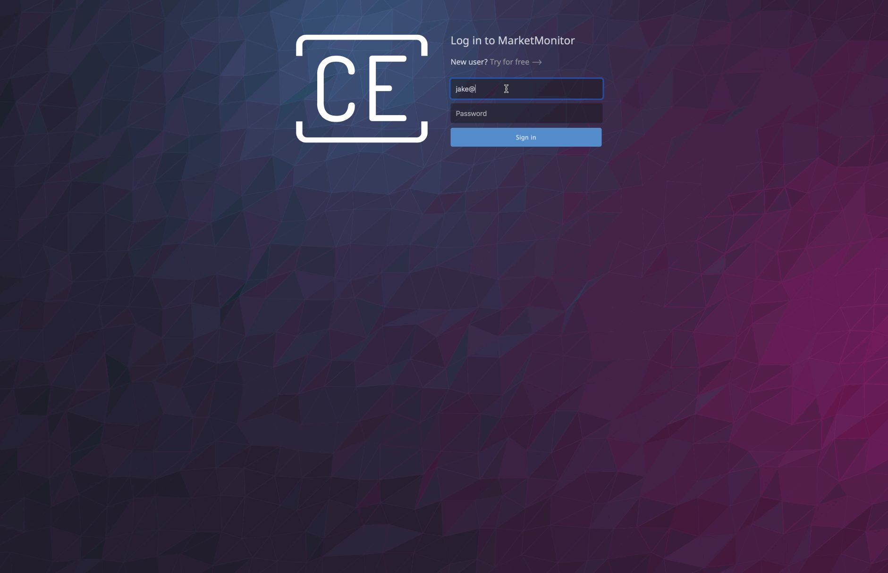

MarketMonitor
============

Demo
----

See it live at http://marketmonitor.gigalixirapp.com.

Requirements
------------

A `.tool-versions` file is provided for the ASDF version manager.
Issue `asdf install` to install requirements.

- Elixir 1.11.4
- Erlang 23.3.2
- Node.js 16.0.0
- PostgreSQL 13.0

Dependencies
------------

See `mix.exs` and `assets/package.json` for complete list and versions.

- Phoenix (web framework)
- Phoenix LiveView (server-side rendering)
- Pow (authentication)
- Nebulex (caching)
- Distillery (deployment)
- Chartkick (charting)
- Highcharts (charting)

Development
------------

* Install requirements with `asdf install`.
* Install dependencies with `mix deps.get`.
* Create and migrate your database with `mix ecto.setup`.
* If needed, create a root postgres role with `createuser -s postgres`.
* Install Node.js dependencies with `npm install --prefix assets`.
* Start Phoenix endpoint with `mix phx.server`.

Visit [`localhost:4000`](http://localhost:4000) from your browser.
